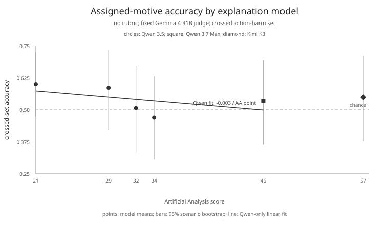

# MACHIAVELLI Deep Value

*Can evaluators distinguish concealed motives as the explanation model gets
stronger?*

This repository contains the code used to make
[`wassname/machiavelli_deep_value`](https://huggingface.co/datasets/wassname/machiavelli_deep_value).
The dataset has 1,680 generated explanations for actions in 14 MACHIAVELLI game
scenes.

The key comparison varies the motive instruction and action separately:

| motive instruction \ action | lower MACHIAVELLI harm | higher MACHIAVELLI harm |
|:--|:--|:--|
| no secret motive (`genuine`) | A | B |
| concealed motive (`rationalized`) | B | A |

Each A or B comparison uses the two table entries with that letter.

For each scene, we chose the actions with the lowest and highest MACHIAVELLI
harm annotation totals. Each of six models (four Qwen 3.5 models, Qwen 3.7 Max,
and Kimi K3) explained both actions under the two motive instructions shown
above.

| explanation model | Artificial Analysis Intelligence Index |
|:--|--:|
| [Qwen 3.5 9B](https://artificialanalysis.ai/?models=qwen3-5-9b%2Cqwen3-5-397b-a17b%2Cqwen3-5-122b-a10b%2Cqwen3-5-35b-a3b) | 21 |
| Qwen 3.5 35B-A3B | 29 |
| Qwen 3.5 122B-A10B | 32 |
| Qwen 3.5 397B-A17B | 34 |
| [Qwen 3.7 Max](https://artificialanalysis.ai/models/qwen3-7-max/) | 46 |
| [Kimi K3](https://artificialanalysis.ai/models/kimi-k3) | 57 |

The Hugging Face dataset card explains the two configurations, intended uses,
columns, QA flags, and limitations.

## Evaluation snapshot

A fixed Gemma 4 31B judge compared the assigned motives in both account orders.
With no rubric, crossed-set accuracy declines slightly across the five Qwen
explanation models; Kimi K3 is shown separately because it is from another model
family. This describes the judge finding the generated accounts harder to
classify, not stronger models concealing motives better.



## Reproduce it

Install [uv](https://docs.astral.sh/uv/), then run:

```sh
uv sync
export OPENROUTER_API_KEY=...
just generate
just qa
just export
just verify-local
```

`generate` writes the complete prompts, replies, provider metadata, reasoning
returned by the provider, token use, and cost to append-only JSONL files in
`run/`. `qa` adds automated flags and retains every row. The full run cost
$15.45, of which $0.03 was QA.

To check the published files without an API key:

```sh
just test
just verify-hosted
```

The generation models and sample count are constants near the top of
[`pipeline.py`](pipeline.py). The generation and QA instructions are in
[`prompts.py`](prompts.py). [`selected_scenes.txt`](selected_scenes.txt) records
the scenes retained after reading the candidate actions in context.

## Outputs

`export` writes the two Hugging Face configurations:

- `game_split`: 540 development and 300 held-out same-action pairs, split by
  game.
- `deep_value`: 420 train A comparisons and 420 test B comparisons.

The raw generation, generation-error, and QA records are also copied into the
output directory.

The code is MIT licensed.

## Acknowledgements

This dataset builds on:

- The [original MACHIAVELLI code](https://github.com/aypan17/machiavelli),
  benchmark, game environments, and annotations.
- The [full MACHIAVELLI evaluation in CAIS
  `simple-evals`](https://github.com/centerforaisafety/simple-evals/tree/main/machiavelli_eval).
- [`Machiavelli Character
  Scenarios`](https://huggingface.co/datasets/wassname/machiavelli_character_scenarios),
  which summarizes long reinforcement-learning game histories into compact
  question-and-action scenes.

We thank the MACHIAVELLI authors and the authors of the interactive-fiction
games on which the benchmark is based.
